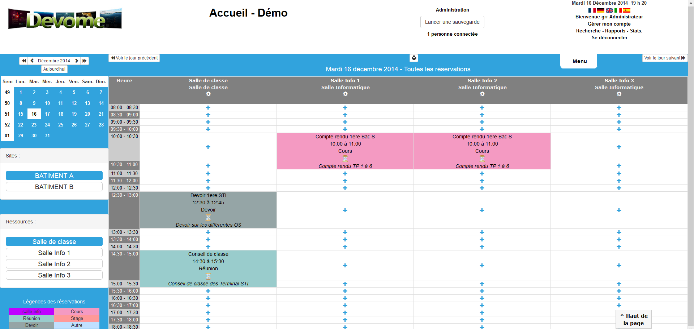

<!--
To README zostało automatycznie wygenerowane przez <https://github.com/YunoHost/apps/tree/master/tools/readme_generator>
Nie powinno być ono edytowane ręcznie.
-->

# Grr dla YunoHost

[](https://ci-apps.yunohost.org/ci/apps/grr/)


[](https://install-app.yunohost.org/?app=grr)

*[Przeczytaj plik README w innym języku.](./ALL_README.md)*

> *Ta aplikacja pozwala na szybką i prostą instalację Grr na serwerze YunoHost.*  
> *Jeżeli nie masz YunoHost zapoznaj się z [poradnikiem](https://yunohost.org/install) instalacji.*

## Przegląd

GRR is a resource reservation management system (rooms, equipment, vehicle, staff) but it can also be used as a shared mini-diary. Developed in php and responsive, which allows it to be accessible, from anywhere and on any type of equipment (PC, Mac, tablet, phone, TV...).


**Dostarczona wersja:** 4.3.9~ynh1

## Zrzuty ekranu



## Dokumentacja i zasoby

- Oficjalna strona aplikacji: <https://site.devome.com/fr/grr3>
- Oficjalna dokumentacja: <https://site.devome.com/fr/grr/telechargement/category/2-informations-documentations>
- Oficjalna dokumentacja dla administratora: <https://site.devome.com/fr/grr/telechargement/category/2-informations-documentations>
- Repozytorium z kodem źródłowym: <https://github.com/JeromeDevome/GRR>
- Sklep YunoHost: <https://apps.yunohost.org/app/grr>
- Zgłaszanie błędów: <https://github.com/YunoHost-Apps/grr_ynh/issues>

## Informacje od twórców

Wyślij swój pull request do [gałęzi `testing`](https://github.com/YunoHost-Apps/grr_ynh/tree/testing).

Aby wypróbować gałąź `testing` postępuj zgodnie z instrukcjami:

```bash
sudo yunohost app install https://github.com/YunoHost-Apps/grr_ynh/tree/testing --debug
lub
sudo yunohost app upgrade grr -u https://github.com/YunoHost-Apps/grr_ynh/tree/testing --debug
```

**Więcej informacji o tworzeniu paczek aplikacji:** <https://yunohost.org/packaging_apps>
