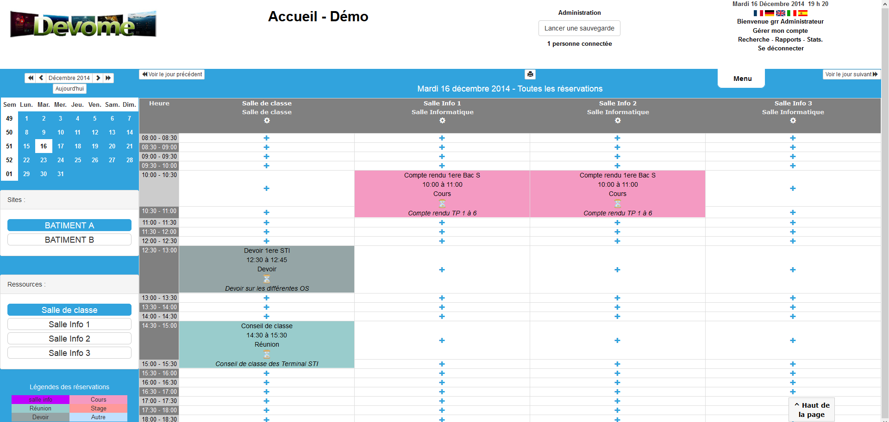

<!--
Важно: этот README был автоматически сгенерирован <https://github.com/YunoHost/apps/tree/master/tools/readme_generator>
Он НЕ ДОЛЖЕН редактироваться вручную.
-->

# Grr для YunoHost

[](https://ci-apps.yunohost.org/ci/apps/grr/)


[](https://install-app.yunohost.org/?app=grr)

*[Прочтите этот README на других языках.](./ALL_README.md)*

> *Этот пакет позволяет Вам установить Grr быстро и просто на YunoHost-сервер.*  
> *Если у Вас нет YunoHost, пожалуйста, посмотрите [инструкцию](https://yunohost.org/install), чтобы узнать, как установить его.*

## Обзор

GRR is a resource reservation management system (rooms, equipment, vehicle, staff) but it can also be used as a shared mini-diary. Developed in php and responsive, which allows it to be accessible, from anywhere and on any type of equipment (PC, Mac, tablet, phone, TV...).


**Поставляемая версия:** 4.3.9~ynh1

## Снимки экрана



## Документация и ресурсы

- Официальный веб-сайт приложения: <https://site.devome.com/fr/grr3>
- Официальная документация пользователя: <https://site.devome.com/fr/grr/telechargement/category/2-informations-documentations>
- Официальная документация администратора: <https://site.devome.com/fr/grr/telechargement/category/2-informations-documentations>
- Репозиторий кода главной ветки приложения: <https://github.com/JeromeDevome/GRR>
- Магазин YunoHost: <https://apps.yunohost.org/app/grr>
- Сообщите об ошибке: <https://github.com/YunoHost-Apps/grr_ynh/issues>

## Информация для разработчиков

Пришлите Ваш запрос на слияние в [ветку `testing`](https://github.com/YunoHost-Apps/grr_ynh/tree/testing).

Чтобы попробовать ветку `testing`, пожалуйста, сделайте что-то вроде этого:

```bash
sudo yunohost app install https://github.com/YunoHost-Apps/grr_ynh/tree/testing --debug
или
sudo yunohost app upgrade grr -u https://github.com/YunoHost-Apps/grr_ynh/tree/testing --debug
```

**Больше информации о пакетировании приложений:** <https://yunohost.org/packaging_apps>
